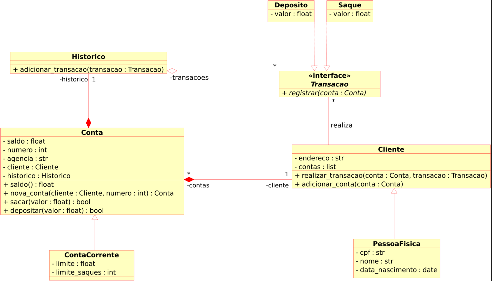

# Terceiro Desafio - Python

> Intruções do desafio proposto e descrição da solução apresentada.

O desafio consiste em melhorar o desafio anterior - "banco" que possui as operações de saque, depósito e extrato - modelando o código através do uso de programação orientada a objetos com algumas condições de contorno definidas e utilizando recursos do Python apresentados no módulo de OOP.

## Descrição do Desafio

**Objetivo geral**: Iniciar a modelagem do sistema bancário utilizando OOP, adicionar classes para clientes e operações bancárias: depósito e saque, atualizar o sistema bancário para armazenar dados de clientes e contas bancárias em objetos ao invés de dicionários.

Para exercitar os conceitos deste módulo, cada classe e método deverar seguir as condições especificadas no UML apresentado em funcionalidades.

Funcionalidades:

Além das duas novas features obrigatórias, fica como desafio extra, modelar por OOP os métodos que tratam as opções do menu fazendo com que trabalhem com as classes modeladas.

## Requisitos - Fundamentos de Python

Conceitos abordados de Python que são essenciais para a resolução do desafio proposto:

- Fundamentos de Python;
- Estrutura de dados;
- Conceitos de Programação Orientada a Objetos;
- Herança utilizando Python;
- Encapsulamento em Python;
- Polimorfismo em Python,
- Interfaces e Classes Abstratas em Python.

## Resolução Proposta

